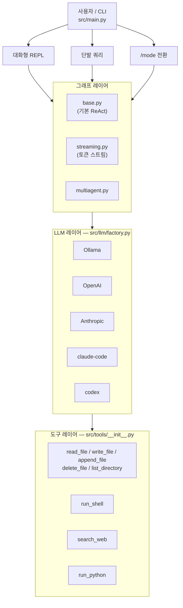
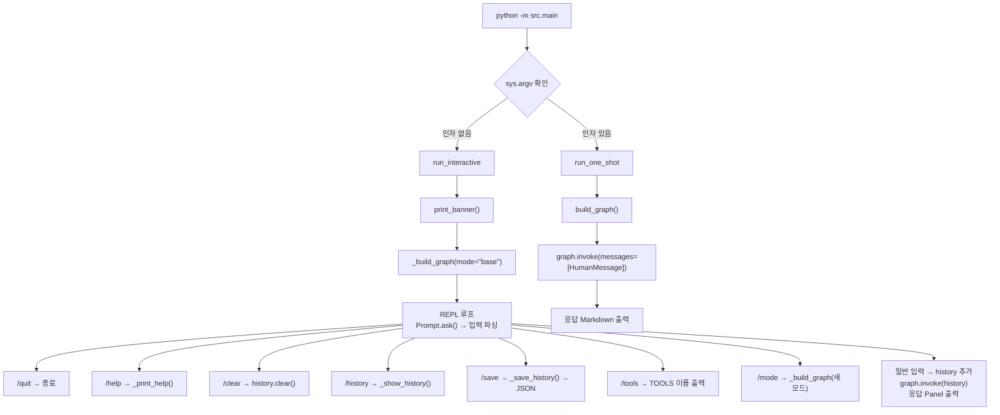
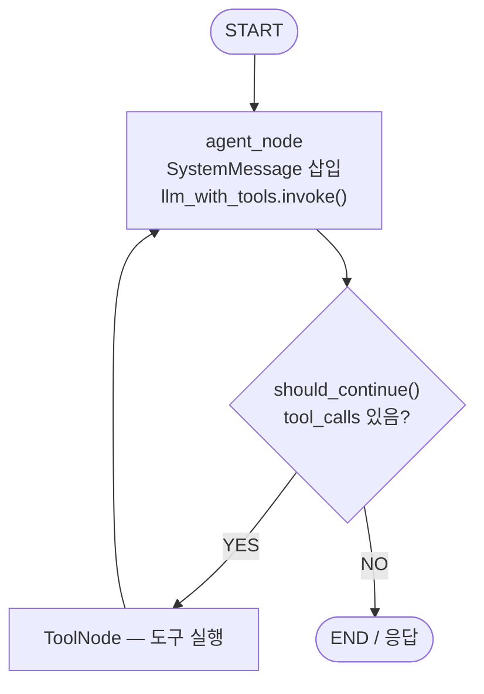
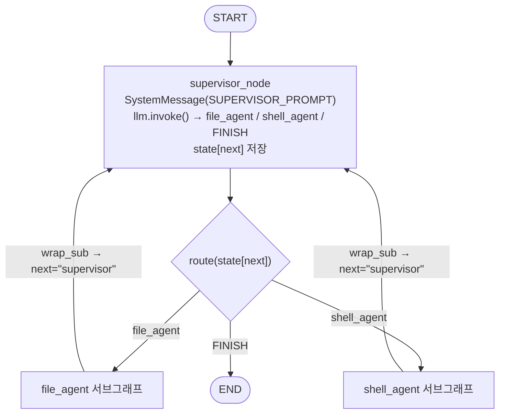
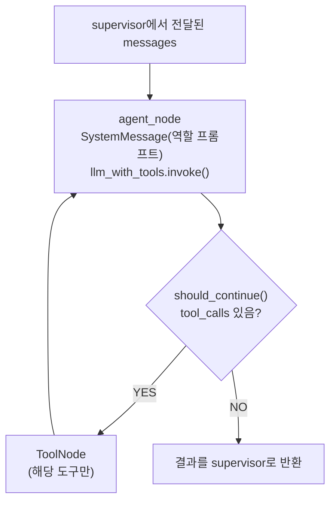
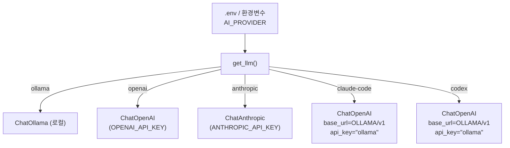
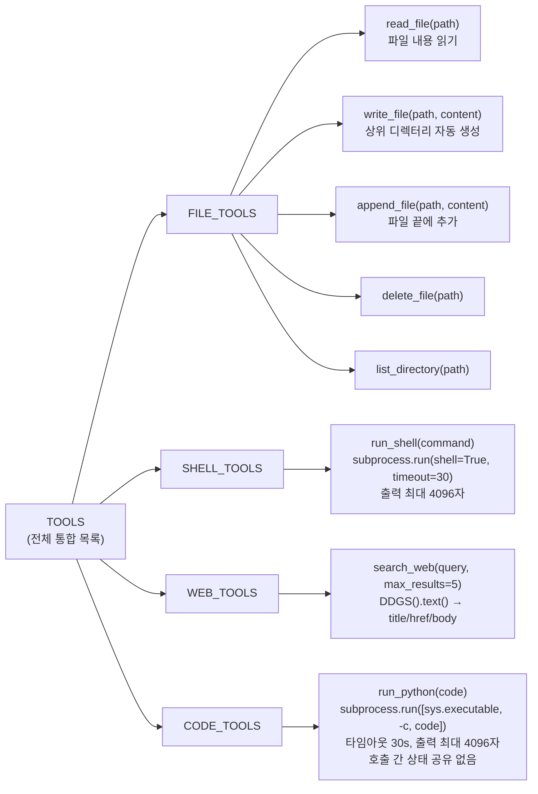
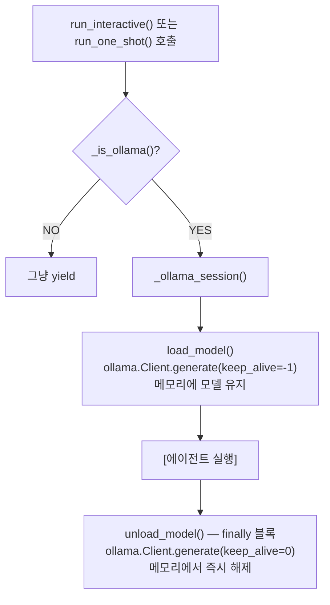
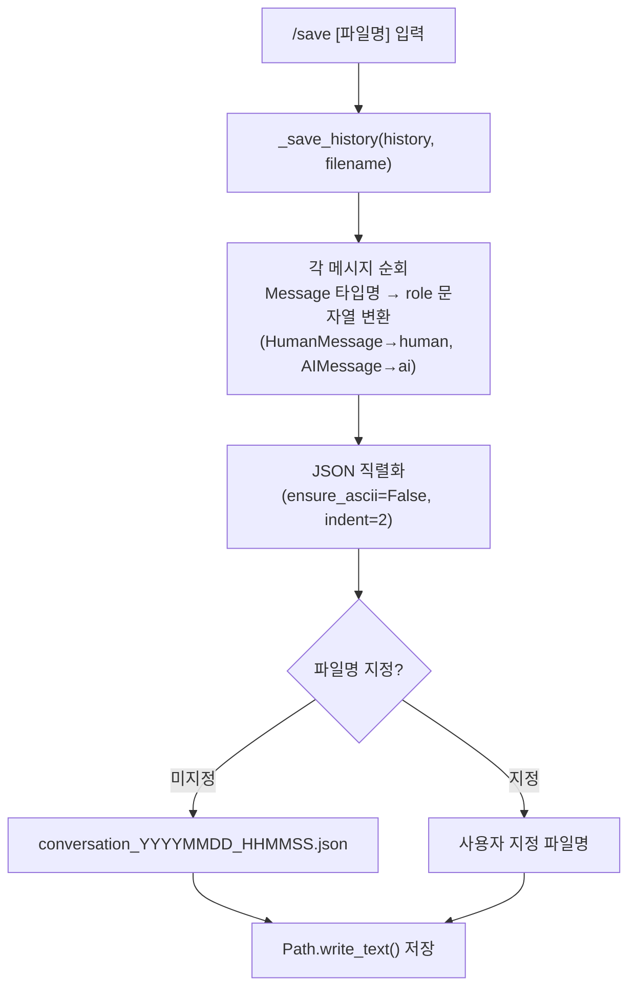
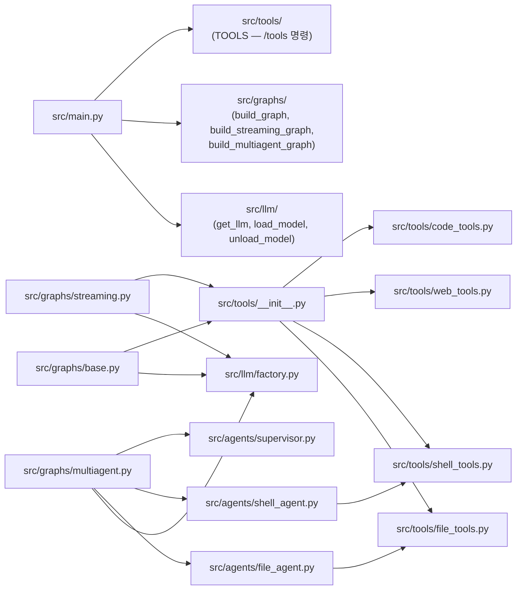

# 프로세스 구조도

## 1. 전체 컴포넌트 관계

---

## 2. CLI 실행 흐름

---

## 3. 기본 ReAct 그래프 (base.py / streaming.py)

> **스트리밍 그래프**: 구조는 동일하며 `graph.stream(stream_mode="messages")`로 토큰 청크를 `yield`해 터미널에 실시간 출력한다.

---

## 4. Supervisor 멀티에이전트 그래프 (multiagent.py)

---

## 5. 서브 에이전트 내부 구조 (file_agent / shell_agent 공통)

- `file_agent` → `FILE_TOOLS` (read / write / append / delete / list)
- `shell_agent` → `SHELL_TOOLS` (run_shell)

---

## 6. LLM 팩토리 선택 흐름

---

## 7. 도구 레이어 상세

---

## 8. Ollama 모델 생명주기

> `unload_model()`은 `finally` 블록에서 실행되므로 예외 발생 시에도 호출된다.

---

## 9. 대화 저장 데이터 흐름

---

## 10. 모듈 의존 관계

